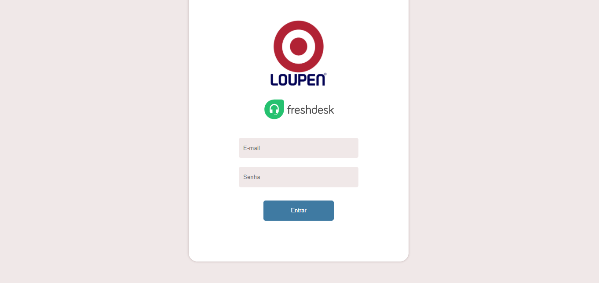
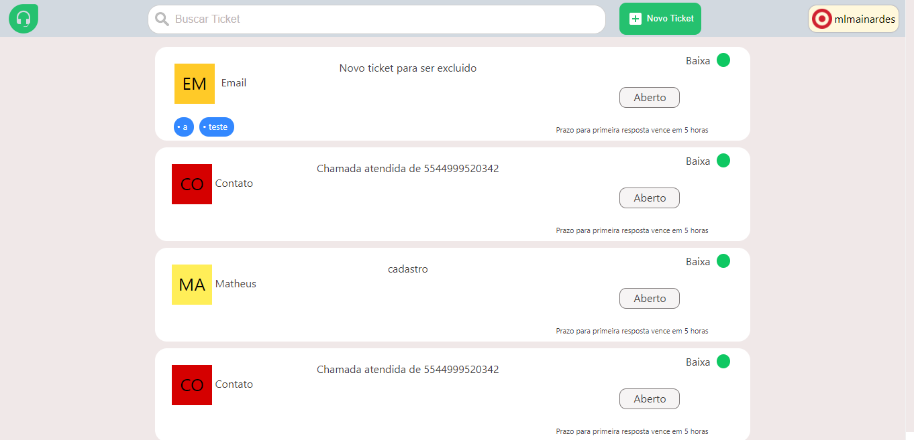
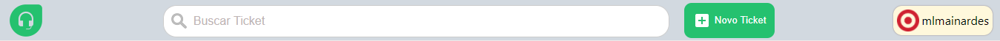
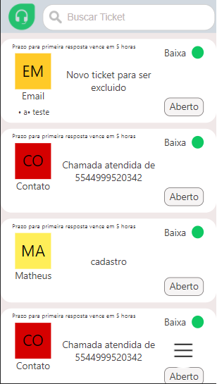
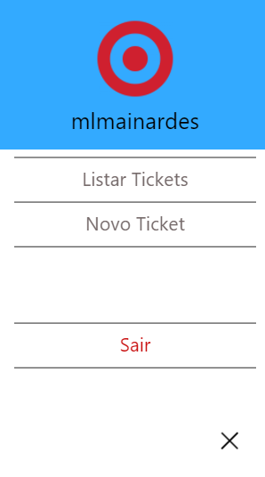
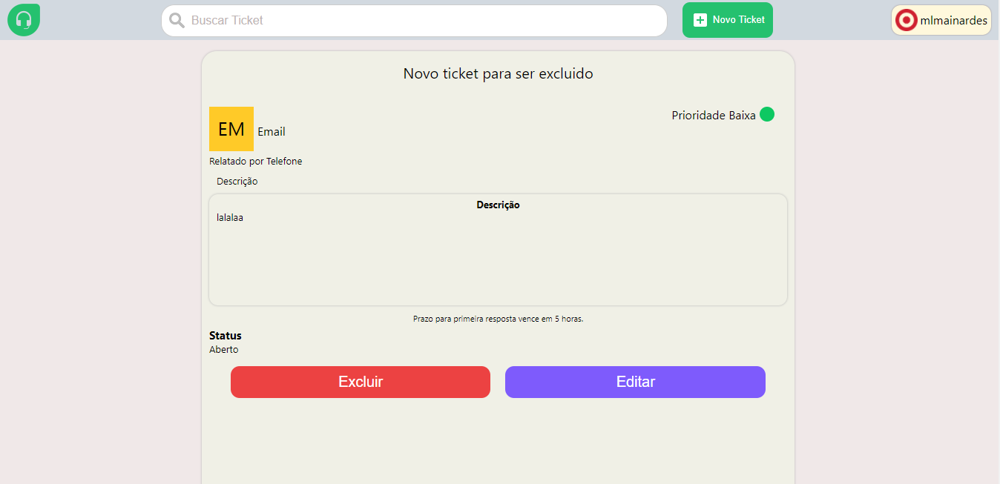

# Manual de uso

Aqui estão descritas as principais funções disponiveis na aplicação.

## Login

  

Na tela de login basta inserir as informações de acesso na plataforma da Freshdesk.

## Home
### web

  

Na tela principal ficam listados os ultimos Tickets cadastrados .

  

A barra superior contem 4 elementos principais.

* **Logo da Freshdesk**
Ao clicar neste icone em outras telas a aplicação irá reotrnar à página peincipal.
 
* **Barra de busca**
Basta inserir algum criterio de busca por tickets e apertar a tecla "Enter" em ambiente web ou "Pesquisar" em abientes mobile.
 
* **Botão novo Ticket**
Ao clicar nesse botão a aplicação irá para atela decadastro de tickets.
 
* **Menu de usuário**
Ao colocar o mouse sobre o nome do usuário será exibido um menu indicando as opções: Listar Tickets e Sair, na primeira a aplicação irá voltar a tela inicial e na segunda a seção será encerrada.

No corpo da tela inicial ficam listados os tickets e algumas informações iniciais para identifica-los, ao clicar em um ticket a pagina de visualização será aberta exibindo os demais campos do ticket.

### mobile

  

Na visualização mobile da aplicação as funcionalidades presentes na barra do topo ficam excondidas no icone:  Localizado no canto inferior direito, ao clicar neste botão o menu de opções é aberto.  
Esta configuração é mantida em todas as telas.

  

## Visualizar ticket

  

Nesta tela ficam exibidas as informações do ticket e aparecem opções para alterar as informações ou excluir o ticket.